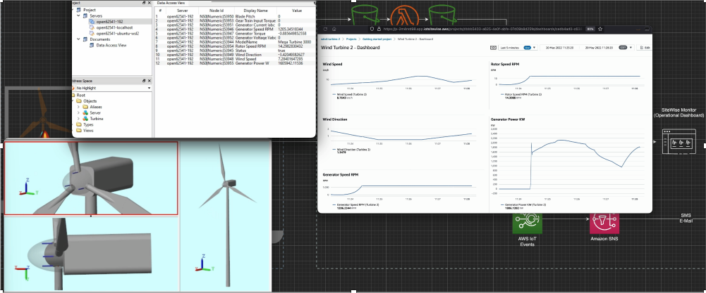

# AWS IoT Connectors for Matlab/Simulink


This project provides code and blocks that will enable connet models and simulations running in Matlab with AWS IoT Services and to exchange data with the them. Two example projects are also provided for the quick start.

MATLAB is a proprietary multi-paradigm programming language and numeric computing environment developed by MathWorks. Simulink, an add-on product to MATLAB, provides an interactive, graphical environment for modeling, simulating, and analyzing of dynamic systems. It enables rapid construction of virtual prototypes to explore design concepts at any level of detail with minimal effort.

You can choose from a large library of virtual models (automotive, space, industrial, etc.) to simulate the edge devices and connect them to the AWS IoT services without the need for physical hardware.

A simple DC-Motor and the complex Wind Turbine multibody model are used for the demo purposes of connecting with the AWS IoT services.

## Repository structure

```
Matlab-IoT-Connectors
├─ assets .................. documentation and images
├─ mqtt  ................... a demo project that communicates over MQTT
│  ├─ certs ................ downloaded certificated will be save here and used from the Matlab blocks
│  └─ setup  ............... a setup scripts that will provision IoT things, policy and download the certificates for the communication
├─ opc-ua .................. a demo project that communicates over OPC-UA
└─ README.md ............... this file
```


## Communication with AWS IoT

There is no out-of-the box solution for connecting to AWS but since Matlab supports industrial protocols, MQTT and OPC-UA support from the industrial toolbox is used to connect to the AWS.

This project will provide you with custom blocks that you can reuse in your projects to connect Matlab/Simulink with the AWS IoT (either via MQTT or OPC-UA).

There are two ways the simulation environment can be connected with AWS IoT Services. One way is to use AWS IoT Core MQTT Broker and connect to it from Simulink. The other way is to use OPC-UA Industrial protocol with AWS GreenGrass and AWS SiteWise.

Currently there are no blocks available for the simulink that can be used directly in your simulations, therefore I implemented these custom blocks to be reused. There are several ways to implement a custom function for the simulink, and one of the ways is the implement it as a custom Matlab S-function.


## Using the IoT connector blocks in a new project

Just copy the block files *.m files and the block masks and copy them to your model.
For the MQTT you'll need the following files:
* mqtt_input.m and the block mqtt_input.slx
* mqtt_output.m and the block mqtt_output.slx

MQTT Output Block parameters are shown in the figure below:

* 1<sup>st</sup> Parameter is the MQTT Client variable that you need to define (see example below)
* 2<sup>nd</sup> Parameter is the your device identifier
* 3<sup>rd</sup> Parameter is the MQTT topic you want to write to
* 4<sup>th</sup> Parameter is the number of input variables that you will send with this block, if changed this will be adjusted so you can connect inputs to this block

For the OPC-UA please copy the following files:
* opcua_output.slx (it includes the model and the code).
Similar to the MQTT Block this block can be parametrized and you can enter the OPC Server IP address and port.


## AWS IoT - MQTT Demo

This demo has a control loop for a DC motor (with Linear voltage control) that will send values (speed, current, power) to AWS IoT Core via MQTT. Also the velocity set value for the DC motor can be changed by sending a MQTT message.
To be able to connect to AWS IoT Core via MQTT the functions in this directory [mqtt](./mqtt/) are used.

You should have a directory with following files:

```
Matlab-IoT-Connectors/mqtt
├─ certs ....................... downloaded certificated will be stored here and used directly from Matlab
└─ setup
│  ├─ my-iot-policy.json ....... an example iot policy needed for the provisioning
│  └─ provision.sh ............. a setup scripts that will provision an IoT thing, policy and download all certificates for the communication
├─ DC_motor_contol_loop.slx .... simulink model of a DC motor
├─ mqtt_input.m ................ block for reading from mqtt
└─ mqtt_output.m ............... block for writing to mqtt
```

Fist you need to provision a device -- you can use one already provisioned -- but if you do not have any, just follow the instructions in the setup directory (see [README.md](./mqtt/setup/README.md)) to create an IoT Thing, and create a policy and attach it to the created IoT Thing, and download the certificated needed for the MQTT communications.


1. create myMQTT variable in Matlab with the command that was outputed from the [provision.sh](mqtt/setup/provision.sh) script, the command should look like:
```bash
    myMQTT = mqttclient('ssl://xxxx-ats.iot.eu-central-1.amazonaws.com', ...
    CARootCertificate = 'AmazonRootCA1.pem', ...
    ClientCertificate = 'matlab-simulator-1-certificate.pem.crt', ...
    ClientKey = '/matlab-simulator-1-private.pem.key');
```
3. Start Matlab and open the provided simulink model [DC_motor_control_loop.slx](/mqtt/DC_motor_control_loop.slx).


4. click on RUN button

- model will run for 100 s (you can change the value to anything else)
- you should see message in the test/motor topic every 0.1s (for example use MQTT tester in the AWS IoT Core to see the messages)


5. Change the set value of the motor speed if desired by sending to MQTT message to the specified topic (set in mqtt_input block)

## AWS SiteWise and AWS GreenGrass OPC-UA

This demo - a wind mill simulation - is more complex simulation. Instead of MQTT, the OPC-UA industrial protocol is used for the data transfer. For the OPC-UA communication we use AWS GreenGrass and AWS IoT SiteWise.

### Setup OPC-UA Demo

You can download the model from  [Mathworks site](https://github.com/mathworks/Simscape-Wind-Turbine) or from the [Github](https://github.com/mathworks/Simscape-Wind-Turbine) and extract it to your work directory.

Prerequisites: Matlab/Simulink with Simscape (Electrical and Multibody) addons installed.

Copy the included Wind_Turbine_opc_ua_demo.slx model and opc_output.m to the work directory (the same where you extracted your downloaded Simscape-Wind-Turbine). Open the file Wind_Turbine.prj to setup the simulation.

On the left side you can see the simulation model of the wind turbine and on the right side
you can see the OPC-UA component and the values that are going to be sent to the SiteWise on (see figure below). 


You will need to provising the following components in the AWS Cloud and also on the edge in order to receive data coming from the OPC-UA server.
You need to install Greengrass and the following greengrass plugins: aws.iot.SiteWiseEdgeCollectorOpcua and aws.iot.SiteWiseEdgePublisher. You also need to deploy a SiteWise Edge Gateway and add opc-ua datasource.
Please refer to the [official AWS GreenGrass documentation](https://docs.aws.amazon.com/greengrass/v2/developerguide/iotsitewise-opcua-collector-component.html) on how to install this. 
You'll need an OPC-UA Server for the communication. If you do not have an opc-ua server you can use [Node OPCUA](https://github.com/node-opcua/node-opcua) or [open62541](https://github.com/open62541/open62541) open source servers.


TODO: SiteWise Model

### AWS Architecture for the Wind Turbine Scenario


You can see the AWS IoT components used in this scenario in the figure above. The AWS IoT SiteWise OPC-UA connector is installed as the Greengrass component and configured to get the data from the external OPC-UA server. In detail the setup is as follows:

1. Telemetry from industrial assets is read by the AWS IoT SiteWise collector running on a local AWS IoT Greengrass core. Industrial Internet of Things (IIoT) data can then be transferred directly with AWS IoT SiteWise. Create a view in AWS IoT SiteWise and define the factory machines as assets. Define the Metrics to be monitored for the factory machines.

2. Data is ingested at scale with asset modelling in AWS IoT SiteWise. Telemetry is exported to an Amazon Simple Storage Service (Amazon S3) bucket, where it is prepared for live inferencing.

3. AWS IoT SiteWise sends asset property values to AWS IoT Events to detect the alarm state. You can specify when the alarm detects and who should be notified when the alarm state changes.

4. Real-time operational dashboard of data (critical asset performance metrics) via AWS IoT SiteWise monitor

5. Build detector models in AWS IoT Events to continuously monitor the state of assets and issue immediate email and SMS alerts via to operational staff via Amazon Simple Notification Service (Amazon SNS)

There are separate hardware components where the software components are run, similar as it would be in the real scenario - you want to isolate the components to have more realistic tests.

The Matlab/Simulink is running on a separate PC (representing Edge Hardware - Industrial machine), and AWS IoT Greengrass is installed on the another device (representing edge gateway).

### Running the Wind Turbine simulation

Where the setup is finished, you just need to press RUN button in the Simulink and the wind turbine simulation data (wind power and direction, motor speed, power, current and torque that get produced) will be sent to the AWS SiteWise models you defined. You can look at the video above to see how it looks when running. In the picture above you see the OPC-UA server and the OPC-UA nodes and values that are sent from the simulation and the SideWise Monitor Dashboard that shows the same data imported into AWS.


You can see the simulation on the left side (left laptop) and the sent asset values in the SiteWise Monitor on the right side (right laptop).


## Hints

* If you want your simulation to run in the near real-time scenario you need to set the simulation pacing options to math the wall clock speed (Run->Simulation pacing)

## Questions
Feel free to reach out to me if you have any questions. [tombach@amazon.com](mailto:tombach@amazon.com)
